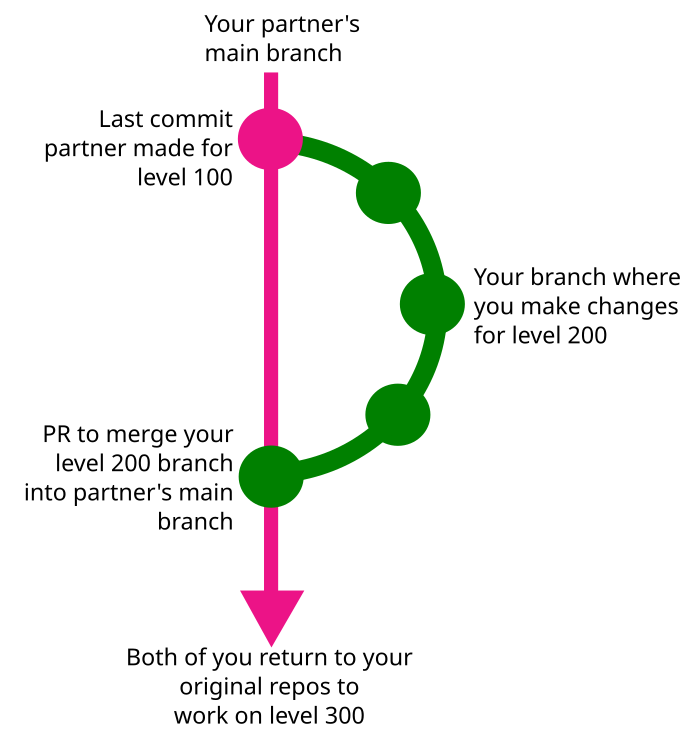
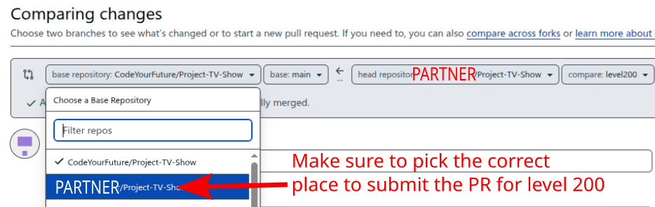
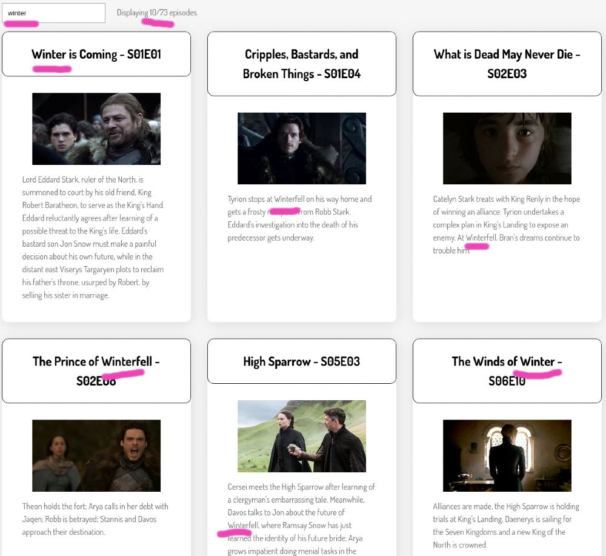
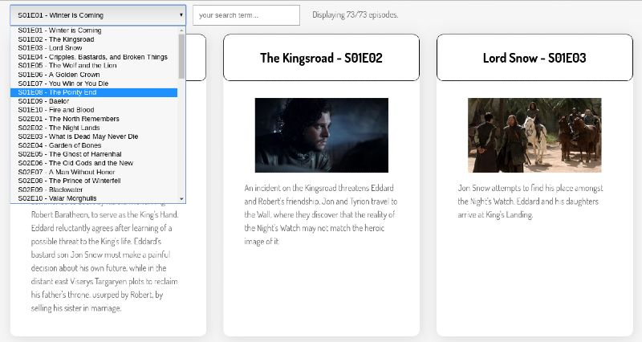

# Level 200

For level 200, you are not allowed to work on the same codebase as you worked on for level 100.

Swap repos with a random person in your class. You may find it helpful to do this first step together:

1. Go to _your_ copy of `Project-TV-Show` and click on the setting
2. Go to the "collaborators" section
3. Next "manage access", click "add people"
4. Type the username your partner
5. Click the green add button
6. Visit the URL for your _partner's_ project and accept the invitation to collaborate / check your email for the invite link
7. Clone your _partner's_ repository to your laptop, you will need to give it a different name, such as `Project-TV-Show-THEIR_NAME`

Now, work individually to complete level 200:

Look at their level 100 implementation.

Compare their implementation to yours. Think:
1. How is it different?
2. What do you prefer about your implementation?
3. What do you prefer about their implementation?
4. What did you learn that you didn't know before?

They should do the same with your repository.

Have a discussion about your answers to these questions. In class, together you should give talk for 5 minutes about your conclusions. (Do this in small groups - we don't want to take all day).

## Refactoring

**Before implementing new features**, take some time to change the codebase you're going to build level 200 in. Change anything you think will make it easier to add more features.

Some example ideas that you may want to think about:
1. Could any variables or functions have more clear names, to help you understand what they do?
2. Would [extracting functions](https://code.visualstudio.com/docs/editor/refactoring) help make some code easier to understand?

Work in a new branch on your _partner's_ repo, making any changes you think are useful.
Then make a pull request to your _partner's_ main branch (take care not to PR to the CYF main branch yet).
Have them review, and when happy, merge your PR.

## Adding new functionality

Level 200 is all about being able to filter episodes.

### Search

Add a live search input which meets the following requirements:

When a user types a search term into the search box:
1. Only episodes whose summary **OR** name contains the search term should be displayed
2. The search should be case-**in**sensitive
3. The display should update **immediately** after each keystroke changes the input
4. Display how many episodes match the current search
5. If the search box is cleared, **all** episodes should be shown

Send a pull request to your partner's repo with this functionality. Have them review, and when happy, merge your PR.

#### Screenshot of minimal version

Note: Provided your project meets the above requirements, it can **look** however you want.

Here is one example layout.

### Episode selector

Add a `select` drop-down which lets the user jump quickly to a particular episode, with the following requirements:
1. The select input should list all episodes in the format: "S01E01 - Winter is Coming"
2. When the user makes a selection, they should be taken directly to that episode in the list
3. Bonus: if you prefer, when the select is used, ONLY show the selected episode. If you do this, be sure to provide a way for the user to see all episodes again.

Send a pull request to your partner's repo with this functionality. Have them review, and when happy, merge your PR.

#### Screenshot of minimal version

Note: Provided your project meets the above requirements, it can **look** however you want.

Here is one example layout.

